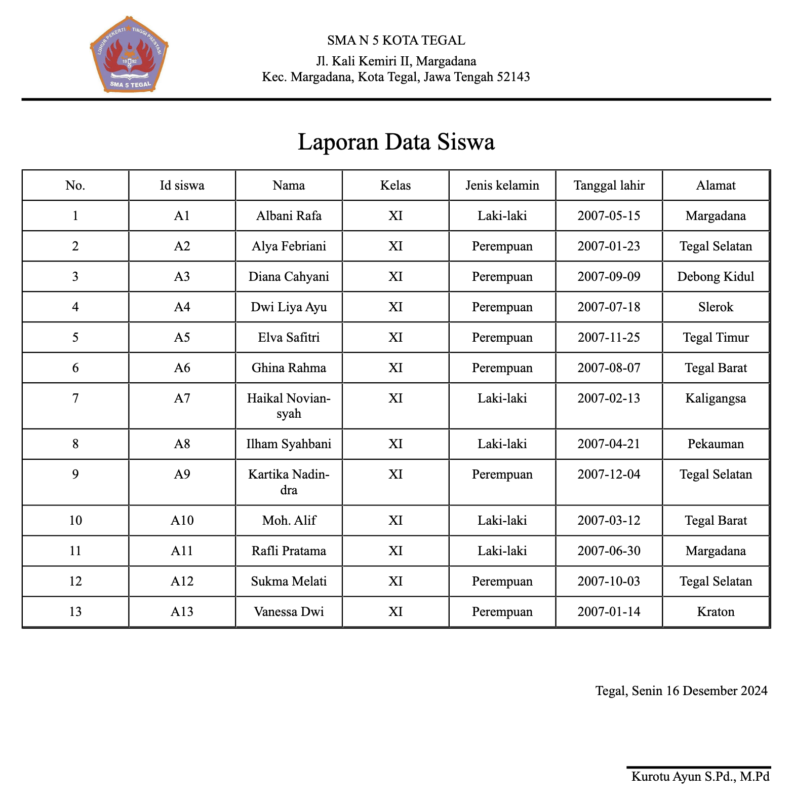

# AHP SMAN 5 Kota Tegal

Proyek ini adalah aplikasi berbasis **Next.js** yang menerapkan metode **Analytic Hierarchy Process (AHP)**. Aplikasi ini menggunakan database **MariaDB/MySQL** untuk menyimpan data

## Prerequisites

Sebelum menjalankan aplikasi, pastikan Anda telah menginstal dan mengonfigurasi hal-hal berikut:

1. **Node.js** versi 18 atau lebih tinggi
    - Anda dapat memeriksa versi Node.js dengan menjalankan perintah:
      ```bash
      node -v
      ```
    - Jika Node.js belum terinstal atau versi Anda lebih rendah dari 18, silakan instal versi terbaru dari [Node.js](https://nodejs.org/).
2. **MariaDB/MySQL** terinstal di mesin Anda (jika ingin menggunakan database lokal)
    - Anda dapat mengunduh dan menginstal MariaDB dari [situs resminya](https://mariadb.org/download/) atau MySQL dari [MySQL download page](https://dev.mysql.com/downloads/).
    - Setelah terinstal, pastikan MariaDB/MySQL Anda berjalan dan dapat diakses melalui `localhost`.

## Konfigurasi Database

1. **Ubah koneksi database di `src/lib/db.ts`**
    - Untuk mengonfigurasi koneksi ke database, Anda dapat menggunakan environment variables. Koneksi akan otomatis menggunakan environment variables yang ada atau fallback ke nilai default jika variabel tersebut tidak ditemukan.
    - Buka file `src/lib/db.ts` dan periksa bagian pengaturan koneksi database:

    ```typescript
   ....
         connection =  mysql.createPool({
            host: process.env.DB_HOST || 'localhost',
            user: process.env.DB_USER || 'root',
            password: process.env.DB_PASSWORD || '123',
            database: process.env.DB_NAME || 'employees',
        });
   ....
    ```

    - Anda dapat mengatur variabel-variabel environment seperti `DB_HOST`, `DB_USER`, `DB_PASSWORD`, dan `DB_NAME` di file `.env` (lihat contoh di bawah).

2. **Buat database menggunakan file `database.sql`**
    - Jika Anda menggunakan database lokal, Anda perlu membuat database terlebih dahulu dengan mengimpor file SQL yang telah disediakan.
    - File `database.sql` berisi skema dan tabel yang diperlukan untuk aplikasi ini.
    - Anda dapat mengimpor file SQL ke MariaDB/MySQL menggunakan command line atau tools seperti **phpMyAdmin** atau **MySQL Workbench**.

   Untuk mengimpor file `database.sql` menggunakan command line, jalankan perintah berikut di terminal:

    ```bash
    mysql -u root -p < path/to/database.sql
    ```

    - Pastikan Anda mengganti `root` dengan username database Anda (jika berbeda) dan `path/to/database.sql` dengan path lengkap menuju file `database.sql`.
    - Jika berhasil, database Anda akan dibuat dan siap untuk digunakan.

## Menjalankan Aplikasi

1. **Install dependensi**
    - Setelah semua persyaratan dan konfigurasi di atas terpenuhi, jalankan perintah berikut untuk menginstal semua dependensi proyek:

    ```bash
    npm install
    ```

2. **Jalankan aplikasi**
    - Untuk menjalankan aplikasi di mode pengembangan, gunakan perintah berikut:

    ```bash
    npm run dev
    ```

3. **Akses aplikasi di browser**
    - Setelah server berjalan, buka browser dan akses aplikasi di:

    ```
    http://localhost:3000
    ```

   Aplikasi akan berjalan di `localhost:3000`, dan Anda dapat mulai menggunakan aplikasi AHP ini.

## Catatan

- Terdapat 2 akun:
  - guru -> username: guru, password: password
  - admin -> username: admin, password: password
- Hasil perhitungan AHP serta laporan menggunakan data dummy, seperti yang ada di bagian **hasil akhir** dan **laporan**.
- Jika Anda membutuhkan implementasi **AHP dengan perhitungan nyata**, silakan **hubungi**:
    - **Email**: [mdipaw@outlook.com](mailto:mdipaw@outlook.com)

## Screenshots

<div style="display: flex; justify-content: space-between; margin-bottom: 10px">
    
    
</div>
<div style="display: flex; justify-content: space-between; margin-bottom: 10px">
    
    
</div>
<div style="display: flex; justify-content: space-between; margin-bottom: 10px">
    
    
</div>
<div style="display: flex; justify-content: space-between; margin-bottom: 10px">
    
</div>

### Cetak Laporan
<div style="display: flex; justify-content: space-between; margin-bottom: 10px">
    
    
</div>
<div style="display: flex; justify-content: space-between; margin-bottom: 10px">
    
    
</div>

---